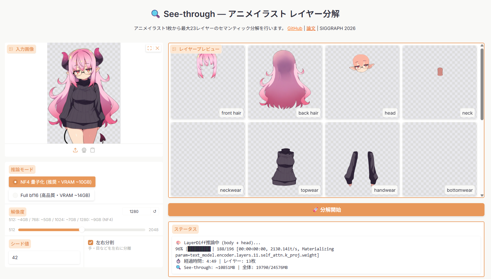

<div align="center">

# See-through WebUI

**アニメイラスト1枚 → 最大23レイヤーに自動分解**

[](https://github.com/shitagaki-lab/see-through)
[](https://arxiv.org/abs/2602.03749)
[](LICENSE)


*[See-through](https://github.com/shitagaki-lab/see-through) のローカル実行用 WebUI です。*
*Python やコマンドラインの知識は不要 — ダブルクリックだけで使えます。*



</div>

---

## 🚀 使い方（たったの2ステップ）

### ステップ 1：インストール

**`install.bat`** をダブルクリックしてください。

あとは待つだけ。以下が全部自動で行われます：
- ✅ Python がなければ自動でインストール
- ✅ AI モデル（約3GB）を自動でダウンロード
- ✅ 必要なソフトを全部セットアップ

> 💡 初回は **15〜30分** かかります（ネット回線によります）。
> 初回ダウンロード総量は約 **6GB**（Python + PyTorch + AI モデル）です。
> 途中で止まっても、もう一度 `install.bat` を実行すれば続きからやり直せます。

### ステップ 2：起動

**`run.bat`** をダブルクリックしてください。

ブラウザが自動で開きます。画像をドラッグ＆ドロップして「生成」を押すだけ！

---

## 💻 必要なもの

| 必要なもの | 条件 |
|-----------|------|
| **OS** | Windows 10 / 11（64ビット） |
| **GPU** | NVIDIA製（GeForce GTX 1060 以上） |
| **VRAM** | 6GB 以上（8GB 以上推奨） |
| **メモリ** | 8GB 以上 |
| **空き容量** | 20GB 以上 |
| **Python** | なくてOK（自動インストールされます） |
| **Git** | なくてOK（Releasesからzipをダウンロードしてください） |

### VRAM と解像度の目安

解像度を上げると高品質になりますが、VRAMを多く使います。
WebUI のスライダーで調整できます。

| 解像度 | VRAM 使用量 | おすすめ環境 |
|--------|-----------|------------|
| 512    | 約 5GB    | GTX 1060 6GB / RTX 3060 |
| 768    | 約 5.5GB  | RTX 3060 / RTX 4060 |
| 1024   | 約 7GB    | RTX 3060 Ti / RTX 4060 Ti |
| 1280   | 約 9GB    | RTX 3080 / RTX 4070 以上 |

---

## ❓ 困ったときは

<details>
<summary><b>ダウンロードや実行時に Windows の警告が出た</b></summary>

ブラウザから ZIP をダウンロードすると、Windows Defender SmartScreen が警告を出すことがあります。
これは未署名の配布物に対する一般的な警告で、ウイルスではありません。

- Chrome: 「保存」→「詳細」→「保持する」
- Edge: 「...」→「保持する」
- 実行時: 「詳細情報」→「実行」
</details>

<details>
<summary><b>install.bat でエラーが出た</b></summary>

- もう一度 `install.bat` をダブルクリックしてみてください（途中から再開できます）
- うまくいかない場合は、`venv` フォルダを丸ごと削除してからやり直してください
- エラーの詳細は `install.log` に記録されています
</details>

<details>
<summary><b>「NVIDIA GPU not detected」と表示される</b></summary>

このツールは **NVIDIA GPU 専用** です（AMD / Intel GPU では動きません）。
NVIDIA GPU があるのにエラーが出る場合は、ドライバを最新版に更新してください。
→ https://www.nvidia.com/drivers
</details>

<details>
<summary><b>生成中に「Out of Memory」と出る</b></summary>

VRAM が足りません。WebUI の解像度スライダーを **512 〜 768** に下げてみてください。
</details>

<details>
<summary><b>ブラウザが自動で開かない</b></summary>

`run.bat` の画面に表示される URL（`http://127.0.0.1:7860` など）を
ブラウザのアドレスバーにコピペしてください。
</details>

---

## 📁 ファイル構成

```
see-through-webui/
├── 📄 install.bat          … インストーラー（初回のみ）
├── 📄 run.bat              … 起動ランチャー（毎回これを使う）
├── 📁 tools/
│   └── webui.py            … WebUI 本体
├── 📁 webui/
│   └── requirements.txt    … 依存パッケージ一覧
├── 📁 inference/           … See-through 推論エンジン（本家由来）
├── 📁 common/              … 共通ユーティリティ（本家由来）
├── 📁 venv/                … Python 仮想環境（install.bat で作成）
└── 📁 .hf_cache/           … AI モデルのキャッシュ
```

---

## 🙏 クレジット

このプロジェクトは **[See-through](https://github.com/shitagaki-lab/see-through)** のフォークです。

**原著論文:**
> Jian Lin, Chengze Li, Haoyun Qin, Kwun Wang Chan, Yanghua Jin, Hanyuan Liu, Stephen Chun Wang Choy, Xueting Liu.
> "See-through: Single-image Layer Decomposition for Anime Characters"
> *ACM SIGGRAPH 2026 Conference Proceedings* — [arXiv:2602.03749](https://arxiv.org/abs/2602.03749)

元プロジェクトの作者の皆さまに心から感謝します。

## 📄 ライセンス

[Apache License 2.0](LICENSE) — 原著プロジェクトと同一のライセンスです。
